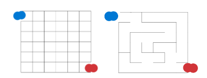

# Kruskal Labyrinth
Implementation of a labyrinth using Kruskal's algorithm to find the MST of a given graph.
## Details
Given the following diagram:\

\
we can see that it has no cycling or non-accesible cells, which can be made using an MST (Minimum Spanning Tree) representation of the graph used to create the labyrinth.
